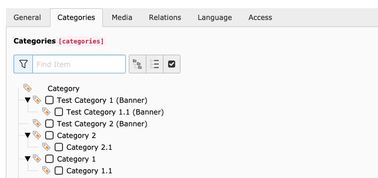
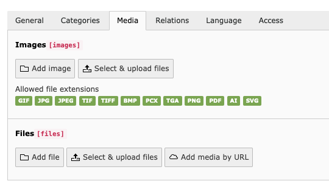
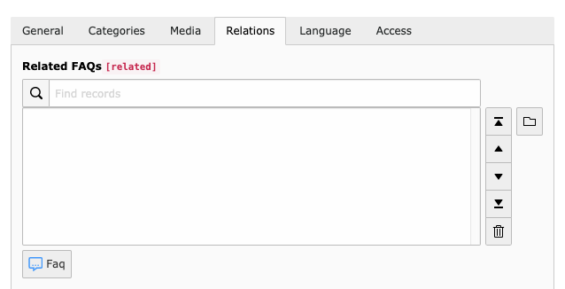

.. ==================================================
.. FOR YOUR INFORMATION
.. --------------------------------------------------
.. -*- coding: utf-8 -*- with BOM.

.. include:: ../../Includes.txt

.. _faqs:

FAQs
====

FAQs are the main record of this extesion. A FAQ contains several fields, which are used to describe the
frequently asked question.

General
~~~~~~~

The general tab is used to add general information about the FAQ like a question, answer and categories.

.. figure:: ../../Images/faq-screenshot.png
   :alt: FAQ general tab

.. t3-field-list-table::
 :header-rows: 1

 - :Field:
         Field:

   :Description:
         Description:

 - :Field:
         Question

   :Description:
         The Question

 - :Field:
         URL Segment (only TYPO3 v9.5+

   :Description:
         URL slug field

 - :Field:
         Answer

   :Description:
         The answer to the questions

 - :Field:
         Keywords

   :Description:
         One or multiple keywords

Categories
~~~~~~~~~~

You can assign one or multiple categories to a FAQ.

.. t3-field-list-table::
 :header-rows: 1

 - :Field:
         Field:

   :Description:
         Description:

 - :Field:
         Category

   :Description:
         One or multiple categories for the FAQ

Media
~~~~~

If media items are required for a FAQ, you can add images or files.

.. t3-field-list-table::
 :header-rows: 1

 - :Field:
         Field:

   :Description:
         Description:

 - :Field:
         Images

   :Description:
         One or multiple images for the FAQ

 - :Field:
         Files

   :Description:
         One or multiple files for the FAQ

Relations
~~~~~~~~~

The relations tab contains a fiels to select related FAQs.

.. t3-field-list-table::
 :header-rows: 1

 - :Field:
         Field:

   :Description:
         Description:

 - :Field:
         Related FAQs

   :Description:
         One or multiple related FAQ records
