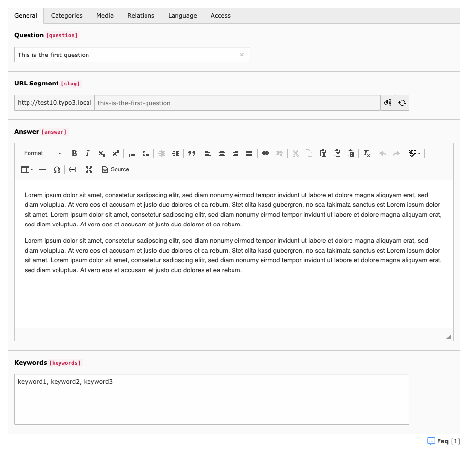

# Plain FAQ 

## What does it do?

This extension for TYPO3 CMS is a solution to manage frequently asked questions. The focus of the extension is to
keep things simple and to have a modern and clean code basis.

**Features:**

* Easy usage for editors
* Uses TYPO3 system categories to structure FAQs by category
* Field for media and files
* Possibility to add related FAQs
* Configurable template layouts for the views
* Automatic cache clearing when FAQ has been changed in backend
* Symfony Console commands to migrate from ext:irfaq
* Signal slots to extend the extension with own functionality

**Background**

* Based on Extbase and Fluid
* Covered with unit and functional tests
* Actively maintained

## Screenshot

The screenshot below shows the backend form of a FAQ record.

## Documentation

The extension includes a detailed documentation in ReST format. You can view the extension manual on TYPO3 TER https://docs.typo3.org/typo3cms/extensions/plain_faq/ or use
ext:sphinx to view the documentation directly in your TYPO3 installation.

## Installation

### Installation using Composer

The recommended way to install the extension is by using [Composer](https://getcomposer.org/). In your Composer based TYPO3 project root, just do `composer require derhansen/plain_faq`. 

### Installation as extension from TYPO3 Extension Repository (TER)

Download and install the extension with the TYPO3 extension manager module.

## Thanks for sponsoring

The initial development of this extension is sponsored by [Julius-Maximilians-Universität Würzburg](https://www.uni-wuerzburg.de).
Thanks for supporting TYPO3 and open source software!

